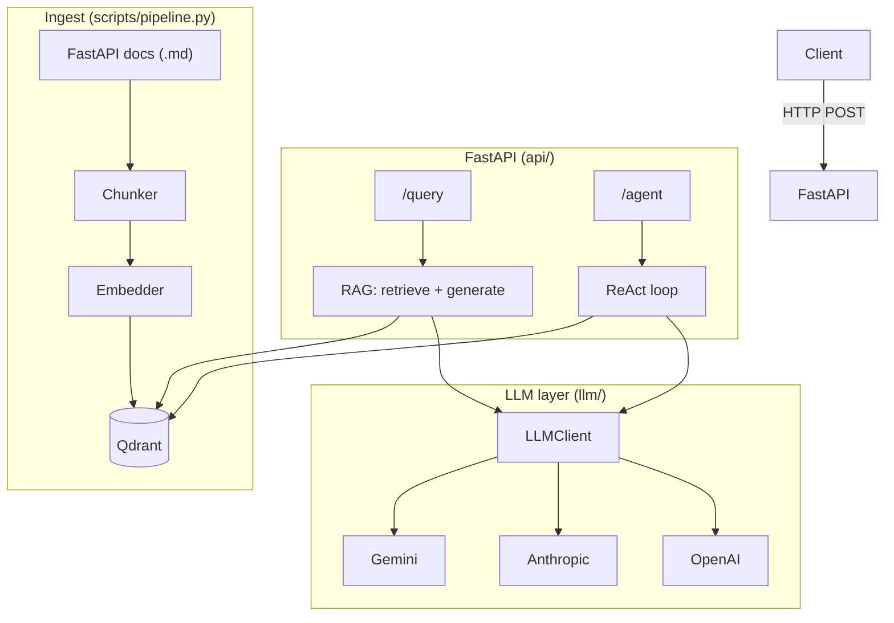

# docs-rag-agent

> Production-style RAG + ReAct agent over FastAPI documentation.
> Multi-provider LLM layer, local embeddings, Qdrant, and a CLI evaluation suite.

[](https://github.com/timuroviceldar19-source/docs-rag-agent/actions/workflows/ci.yml)


## Features

- **Multi-provider LLM** — Gemini, Anthropic, OpenAI, Groq via a shared `Protocol`; swap with one env var
- **Local embeddings** — `fastembed` (BAAI/bge-small-en-v1.5), no embedding API costs
- **Hybrid retrieval** — dense (BGE) + sparse (BM25) with server-side RRF fusion in Qdrant
- **Cross-encoder reranker** — `BAAI/bge-reranker-base` for two-stage retrieval
- **Qdrant vector store** — named-vector layout (dense + bm25 with IDF modifier)
- **Ingest pipeline** — Markdown → chunk → embed → upsert, idempotent
- **ReAct agent** — multi-step reasoning loop with `search_docs` tool (`/agent` endpoint)
- **FastAPI layer** — `/query`, `/agent`, `/healthz` (+ `/query/stream`, `/agent/stream` SSE) with full Pydantic v2 models
- **Retrieval evals** — hit rate, MRR, LLM-as-judge faithfulness on a 10-item golden set
- **Optional Langfuse tracing** — zero cost when keys absent
- **Docker Compose** — `docker-compose up --build` starts Qdrant + API
- **76 tests** — pure unit tests, no external services, no API keys required

### Retrieval benchmark

Measured on a 10-item golden set (`data/eval_dataset.json`) over the FastAPI docs corpus
(8755 chunks). Numbers are exact, captured by `scripts/eval.py`.

| Pipeline | Hit Rate@5 | MRR@5 |
|---|---|---|
| Dense only (BGE-small) | 80% | 0.462 |
| Dense + cross-encoder rerank | **100%** | **0.557** |
| Hybrid (dense + BM25 + RRF) | 70% | 0.540 |
| Hybrid + cross-encoder rerank | 80% | 0.517 |

Honest read: on this dataset, where queries are natural-language documentation
questions and the corpus is well-edited prose, **dense + reranker wins**. Hybrid
helps less because BGE-small already captures intent; BM25 mostly adds noise from
tokens that overlap with off-topic chunks. Hybrid is wired in as the production
pipeline because it pays off on keyword-heavy workloads (code identifiers, exact
terminology, acronyms) — the architecture is the point. Toggle either layer
independently via `HYBRID_ENABLED` / `RERANK_ENABLED`.

## Architecture



## Quickstart

### Prerequisites

- Python 3.11
- Docker + Docker Compose
- A Gemini API key (or Anthropic/OpenAI — set `LLM_PROVIDER`)

### Install

```bash
git clone https://github.com/timuroviceldar19-source/docs-rag-agent.git
cd docs-rag-agent
python -m venv .venv
source .venv/bin/activate      # Linux/macOS
.venv\Scripts\activate         # Windows
pip install -e ".[dev]"
```

### Configure

```bash
cp .env.example .env
# Set GEMINI_API_KEY (or ANTHROPIC_API_KEY / OPENAI_API_KEY)
# Optionally set LLM_PROVIDER (default: gemini)
```

### Start Qdrant

```bash
docker-compose up qdrant -d
```

### Ingest FastAPI docs

```bash
python scripts/pipeline.py --docs-dir data/fastapi-docs
```

### Run the API

```bash
uvicorn docs_rag_agent.api.main:app --reload
# → http://localhost:8000/docs
```

### Run the Streamlit UI (optional)

In a second terminal, with the API already running:

```bash
pip install -e ".[ui]"
streamlit run streamlit_app/app.py
# → http://localhost:8501
```

The UI hits `BACKEND_URL` (default `http://localhost:8000`). Override via env var if the API runs elsewhere.

### Full stack with Docker

```bash
docker-compose up --build
```

## API Usage

**Query (single-step RAG):**

```bash
curl -X POST http://localhost:8000/query \
  -H "Content-Type: application/json" \
  -d '{"question": "How do I declare path parameters?", "top_k": 5}'
```

**Agent (multi-step ReAct):**

```bash
curl -X POST http://localhost:8000/agent \
  -H "Content-Type: application/json" \
  -d '{"question": "What is the difference between path and query parameters?", "max_iterations": 5}'
```

**Streaming (SSE):**

Both endpoints have streaming variants — `POST /query/stream` and `POST /agent/stream` — returning `text/event-stream`.

```bash
curl -N -X POST http://localhost:8000/query/stream \
  -H "Content-Type: application/json" \
  -H "X-API-Key: dev-key" \
  -d '{"question": "How do I declare path parameters?", "top_k": 5}'
```

`/query/stream` frame schema:

| event    | when             | `data` payload                                            |
|----------|------------------|-----------------------------------------------------------|
| `chunks` | once, up front   | `{"chunks": [{text, source, heading, score}, ...]}`       |
| `token`  | many, in order   | `{"text": "..."}` — append to accumulator                 |
| `end`    | once, at the end | `{"model", "input_tokens", "output_tokens"}`              |
| `error`  | on failure       | `{"detail": "..."}` (replaces `end` — stream is cut)      |

`/agent/stream` emits one `step` event per ReAct turn (`{thought, action, action_input, observation, final_answer}`) and exactly one `final` event at the end (`{answer, chunks, model, input_tokens, output_tokens}`).

Errors are surfaced as `event: error` frames inside the stream, never as 5xx — so the HTTP status is always 200 once the stream opens.

**Retrieval eval:**

```bash
# Requires Qdrant running with ingested docs
python scripts/eval.py --top-k 5                              # hit rate + MRR (hybrid by default)
python scripts/eval.py --top-k 5 --judge                      # + LLM-as-judge faithfulness
python scripts/eval.py --top-k 5 --judge --rerank             # + cross-encoder reranker
python scripts/eval.py --top-k 5 --no-hybrid --rerank         # dense-only retrieval (the winning configuration)
python scripts/eval.py --mode agent --judge --rerank          # end-to-end ReAct agent eval
```

## Running tests

```bash
pytest          # 76 tests, no network required
mypy src/       # strict type check, 25 source files
ruff check .    # linting
```

## Tech stack

| Layer | Technology |
|---|---|
| API | FastAPI 0.115 + Pydantic v2 |
| LLM | Gemini / Anthropic / OpenAI (swappable Protocol) |
| Embeddings | fastembed · BAAI/bge-small-en-v1.5 (dense) + Qdrant/bm25 (sparse) |
| Reranker | BAAI/bge-reranker-base (cross-encoder, optional) |
| Vector DB | Qdrant — named-vector layout, server-side RRF fusion |
| Config | pydantic-settings |
| CLI | Typer |
| Tests | pytest 8 · mypy --strict · ruff |
| Tracing | Langfuse (optional) |
| Container | Docker + Docker Compose |
| UI | Streamlit (optional) |

## Project structure

```
src/docs_rag_agent/
├── api/          # FastAPI app, endpoints, dependency singletons
├── agent/        # ReAct loop and tool execution
├── llm/          # Multi-provider LLM abstraction (Protocol + 3 clients)
├── embeddings/   # fastembed local embedder
├── retrieve/     # Qdrant vector store wrapper
├── ingest/       # Markdown chunker and ingestion pipeline
├── eval.py       # Retrieval + faithfulness eval functions
├── config.py     # pydantic-settings configuration
└── tracing.py    # Optional Langfuse tracing
scripts/
├── pipeline.py   # Ingest CLI (Typer)
└── eval.py       # Eval CLI (Typer)
data/
└── eval_dataset.json  # 10 golden QA pairs
```

## License

MIT
