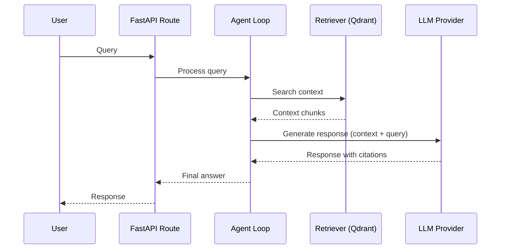

# Architecture

## Goals & non-goals

### Goals
- End-to-end RAG over FastAPI documentation.
- Multi-provider LLM support (Gemini, Anthropic, OpenAI).
- Comprehensive evaluations and tracing.
- Clean, modular architecture.

### Non-goals
- Training or fine-tuning models.
- Building a general-purpose RAG framework.
- Supporting non-markdown corpora.

## High-level diagram



## Module layout (target)

The project structure by the end of week 1:

```
docs_rag_agent/
├── __init__.py
├── config.py            # pydantic-settings; loads .env
├── llm/
│   ├── base.py          # LLMClient protocol
│   ├── gemini.py
│   ├── anthropic.py
│   ├── openai.py
│   └── factory.py       # build_llm_client(settings) -> LLMClient
├── embeddings/
│   ├── base.py
│   └── fastembed_local.py
├── ingest/
│   ├── fetch.py         # download FastAPI docs
│   ├── chunk.py         # markdown-aware splitting
│   └── pipeline.py      # typer CLI: ingest
├── retrieve/
│   └── store.py         # Qdrant wrapper
└── api/
    └── main.py          # FastAPI app: /healthz, /query
```

## Key interfaces

### LLMClient Protocol
```python
class LLMClient(Protocol):
    async def generate(self, messages: list[Message], *, max_tokens: int, temperature: float) -> LLMResponse:
        ...
```

### Embedder Protocol
```python
class Embedder(Protocol):
    def embed(self, texts: list[str]) -> list[list[float]]:
        ...
```

### VectorStore Interface
```python
class VectorStore:
    def upsert(self, points: list[Point]) -> None:
        ...
    def search(self, query_vector: list[float], limit: int) -> list[SearchResult]:
        ...
```

## Data flow

### Ingest
1. **Fetch:** Download markdown files from the FastAPI repository.
2. **Chunk:** Split markdown files into meaningful chunks while preserving structure.
3. **Embed:** Generate vector embeddings for each chunk using `fastembed`.
4. **Store:** Upsert chunks and their embeddings into Qdrant.

### Query
1. **Receive:** FastAPI endpoint receives a user query.
2. **Retrieve:** Agent searches Qdrant for relevant context chunks.
3. **Augment:** Construct a prompt with the retrieved context and user query.
4. **Generate:** Call the configured LLM provider to generate a response.
5. **Respond:** Return the response along with citations.

## Trade-offs and decisions

- **Decision:** Gemini default vs Anthropic default. **Reason:** Gemini 2.0 Flash is currently very fast and cost-effective for development. **Alternative considered:** Claude 3.5 Sonnet.
- **Decision:** Local embeddings vs API embeddings. **Reason:** `fastembed` avoids API latency and costs during the high-frequency development phase. **Alternative considered:** OpenAI `text-embedding-3-small`.
- **Decision:** Qdrant vs pgvector vs Chroma. **Reason:** Qdrant offers a specialized, high-performance vector search engine with a clean API. **Alternative considered:** pgvector for SQL integration.
- **Decision:** No LangChain in week 1. **Reason:** Minimizes dependency complexity and allows for a more direct implementation of the RAG pattern. **Alternative considered:** LangGraph for agentic workflows.
- **Decision:** `src` layout vs flat layout. **Reason:** Standard practice for modern Python projects to ensure clean imports and packaging. **Alternative considered:** Flat layout for simplicity.

## What is intentionally out of scope

- Authentication and authorization.
- Multi-tenant support.
- Streaming responses (targeted for week 4).
- Distributed ingest pipelines.
- GPU acceleration (focus is on CPU-efficient models).

## Glossary

- **RAG:** Retrieval-Augmented Generation, a technique to provide LLMs with external context.
- **Embedding:** A numerical representation of text that captures semantic meaning.
- **Vector Store:** A database optimized for storing and searching high-dimensional vectors.
- **LLM Provider:** A service that provides access to Large Language Models (e.g., Google, Anthropic, OpenAI).
- **Agent Loop:** The logic that coordinates retrieval and generation steps to fulfill a user request.
